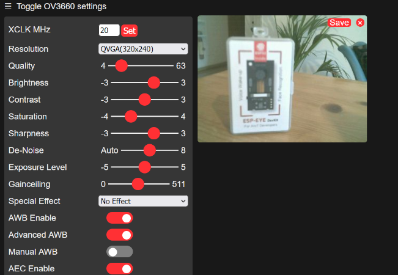

# Get started with ESP-EYE

This brief tutorial shows how to start with the first example of ESP-EYE. The required documentation is already all on the espressif esp-who repo but it's somewhat scattered around. 

In this example the esp-eye camera will take a video streaming (or single pictures) which are shown on a web page served by the esp-eye acting as an access point.

These steps are tested on a Windows 11 machine. You need to have [git](https://git-scm.com/download/win) installed and the ESP-EYE Devkit connected to your computer. 


## Install ESP-IDF

To install ESP-IDF we will use vscode extension. 
1. Install [vscode](https://code.visualstudio.com/). 
2. Open vscode and go to `Extensions` by clicking `CTRL-SHIFT-x` or clicking on the icon on the left side of the screen.
3. Search for the plug-in "Espressif IDF" and install it. 
4. Configure Espressif IDF: open the command palette (`CTRL-SHIFT-p`) and write "ESP-IDF: Configure ESP-IDF extension option.". Go through the Express configuration. 

For more detail please check reference [1](#references). 

## Download ESP-WHO

Open a terminal and clone the esp-who repo
```
git clone --recursive https://github.com/espressif/esp-who.git
```
It may take a while. 

For more detail please check reference [2](#references). 

## Compile and flash the example

1. Open the folder in vscode: Go to the folder `esp-who/examples/human_face_detection/` right click and select `Open in terminal`. In the terminal write `code .` in order to open the folder in vscode. Alternatively open vscode and open the folder from vscode GUI. 
2. Set the ESP core: Open the command palette `CTRL-SHIP-p` and start writing "ESP-IDF: Set Espressif device target". Hit enter and click on the path which appears below the command palette. After then select `ESP32` and then `ESP32 Chip (via ESP USB Bridge)`. 
3. Set the flash port: Similarly, start writing "ESP-IDF: Select port to use (COM, TTY, usb serial)" and select the correct port at which the esp-eye is connected (e.g. `COM5`).

4. (Optional) Verify that ESP-EYE is selected: Open the command palette again and start writing "ESP-IDF: SDK configuration editor (menuconfig)". Once the menuconfig opens, search for "esp-who" in the research field and make sure the `Camera configuration` dropdown menu is set to `ESP-EYE Devkit`, as shown in the picture below. 


5. Build and Flash: In the command palette write "ESP-IDF: Build, Flash and start a monitor on your device". The compilation starts and it will take some time. 
When the flash is completed, you should start seeing debug info on the console in the lower corner of vscode. 


## Run the example

The esp-eye is acting as an access point at which you need to connect your computer. Open the wifi configuration and select the AP "Human Face Detection". 
Open your browser and write on the address bar "http://192.168.4.1:80". You should see a webpage with a few buttons. Scroll down until you see the button for starting the streaming. 
Go back to top and you should see a video streaming of the camera output.




## References:

1. [Espressif plug-in installation guide](https://github.com/espressif/vscode-esp-idf-extension/blob/master/docs/tutorial/install.md).

2. [Espressif esp-who repo](https://github.com/espressif/esp-who).
 [Espressif esp-who repo](https://github.com/espressif/esp-who).
[Espressif esp-who repo](https://github.com/espressif/esp-who).

